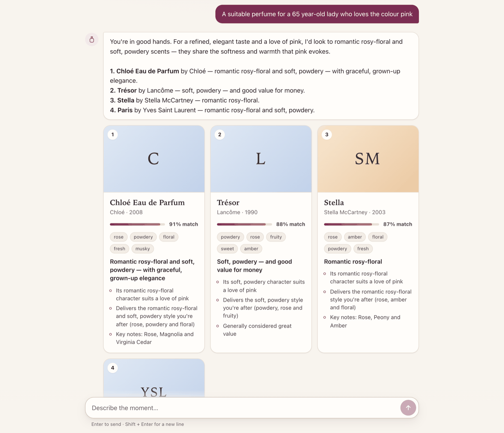
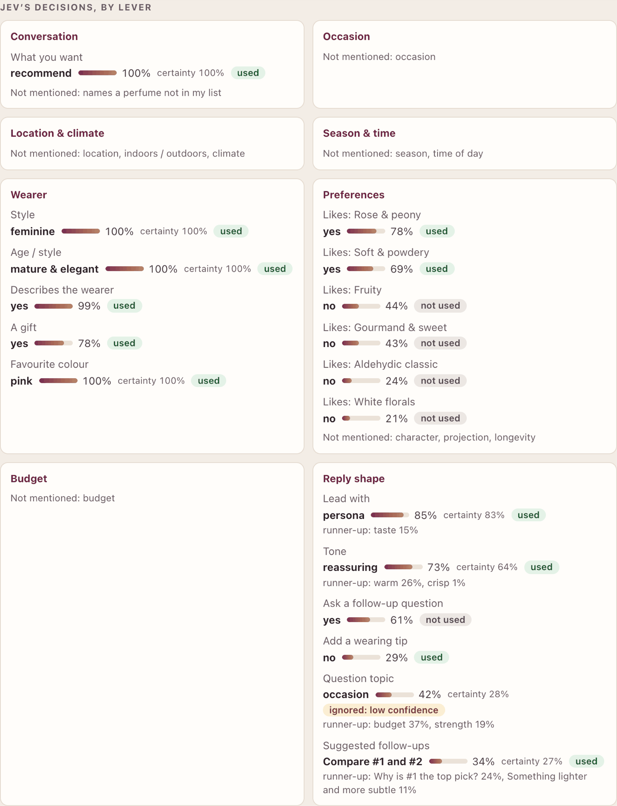
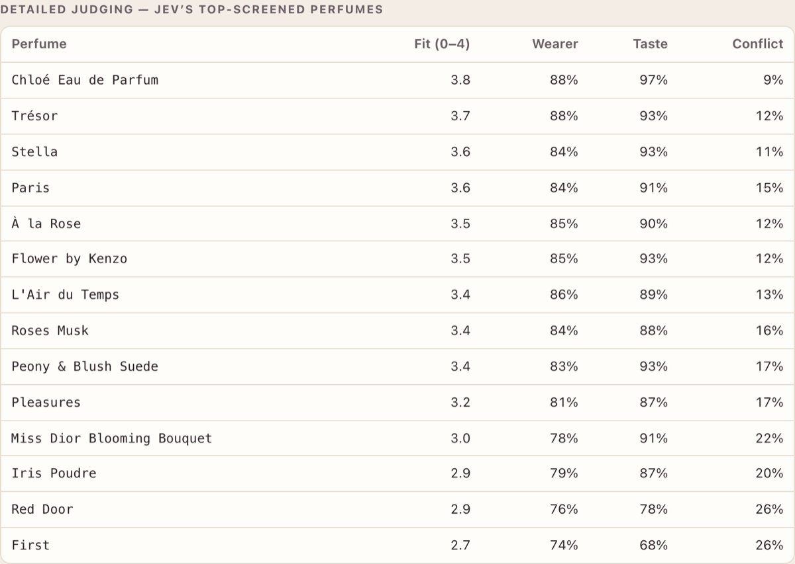
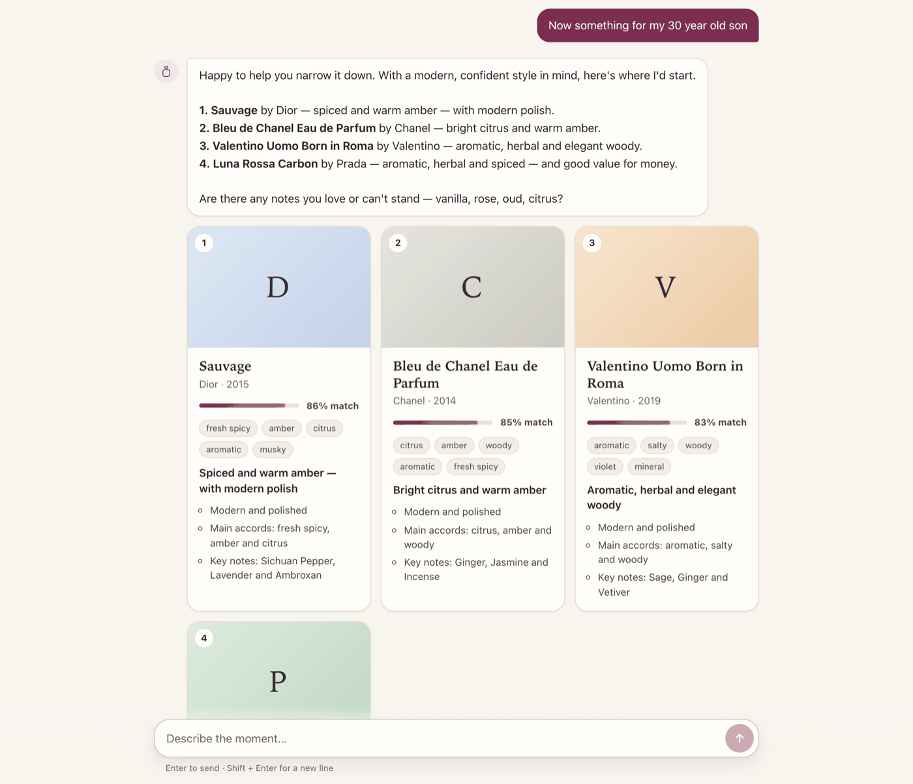
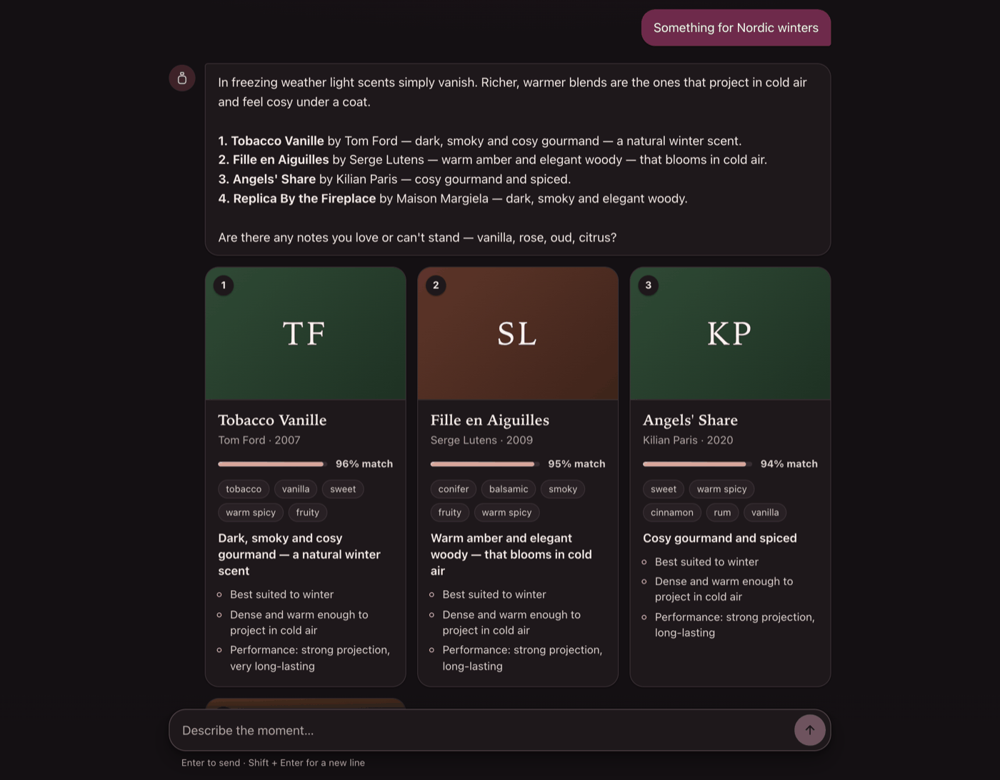
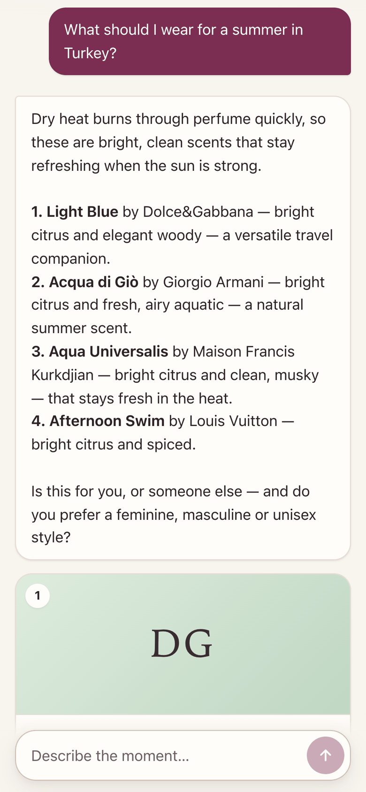

# Scent Sommelier

[](https://github.com/sidhasadhak/jev-perfume-advisor/actions/workflows/ci.yml)
[](LICENSE)


A perfume-recommendation chatbot powered by **[TypeSafe Jev](https://docs.typesafe.ai)** - a model
that returns typed, calibrated decisions instead of text - over fragrance data in
**[FragDB](https://fragdb.net)** format.

Ask it things like:

- *Suggest me a perfume for an evening party*
- *Something for Nordic winters*
- *What should I wear for a summer in Turkey?*
- *Best perfume for a working professional*
- *A suitable perfume for a 65-year-old lady who loves the colour pink*

…and follow up naturally: *"something cheaper"*, *"why the second one?"*, *"compare #1 and #2"*,
*"now something for my son"*. Every reply has a **"How Jev decided"** panel showing each typed
decision Jev made, with its probability.

<p align="center">
  
  <br><em>A live reply: Jev read "loves the colour pink" as a taste for rosy and powdery scents.</em>
</p>

## Quick start

### Option A - Node.js (macOS, Linux, Windows)

You need [Node.js](https://nodejs.org) **20.12 or newer** (check with `node --version`) and git.

```bash
git clone https://github.com/sidhasadhak/jev-perfume-advisor.git
cd jev-perfume-advisor
npm install
npm run setup
npm start
```

`npm run setup` creates your `.env` and asks for a Jev API key (the input is hidden; press Enter to
skip and try mock mode). Then open **http://localhost:8787**.

### Option B - Docker (no Node.js needed)

You need [Docker Desktop](https://www.docker.com/products/docker-desktop/), or Docker Engine with the
Compose plugin v2.24 or newer (check with `docker compose version`), and git - or use GitHub's
**Code → Download ZIP** instead of `git clone`.

```bash
git clone https://github.com/sidhasadhak/jev-perfume-advisor.git
cd jev-perfume-advisor
docker compose up --build
```

Open **http://localhost:8787**. Stop it with Ctrl+C (and `docker compose down` to remove it). To use the
real model, create a file named `.env` in the folder with one line, `OPENROUTER_API_KEY=your-key`, then
run `docker compose up --build` again. Your key is read at start-up and never built into the image.

### Getting a Jev API key

- **[OpenRouter](https://openrouter.ai/keys)** (easiest) - Jev is served as `typesafe/jev-latest` at
  $0.042 per million input tokens, output free. A chat reply costs about **$0.002**.
- **[TypeSafe](https://console.typesafe.ai)** directly - put it in `TYPESAFE_API_KEY` instead.
- **No key?** The app runs in clearly labelled **mock mode**: a keyword heuristic stands in for Jev so
  you can try the interface, but the recommendations are much weaker. The page shows an amber
  *"Mock mode - not calling Jev"* badge.

### Other ways to use it

```bash
npm run chat                                        # chat in the terminal
npm run chat -- "a perfume for Nordic winters" --debug   # one question, with Jev's trace
npm run smoke                                       # the five example questions against live Jev (~$0.01)
```

## Troubleshooting

| Problem | Fix |
|---|---|
| *"This app needs Node.js 20.12 or newer"* | Install the current LTS from [nodejs.org](https://nodejs.org), or run `nvm install` (the repo has an `.nvmrc`). |
| The badge says **Mock mode** | No key was found. Run `npm run setup` again (or edit `.env`), then restart `npm start`. With Docker: put `OPENROUTER_API_KEY=your-key` in `.env` and run `docker compose up --build` again. |
| *"The Jev API rejected the API key"* | Check the key. An OpenRouter key (`sk-or-…`) belongs in `OPENROUTER_API_KEY`; remove any `TYPESAFE_API_BASE` line you did not add on purpose. |
| *"insufficient credits"* | Add credit to your OpenRouter account. |
| Port 8787 is already in use (`npm start`) | In `.env`, change the line `PORT=8787` to e.g. `PORT=8788` (or run `PORT=8788 npm start`), then open http://localhost:8788. |
| Port 8787 is already in use (Docker) | Add `HOST_PORT=8788` to `.env` (or run `HOST_PORT=8788 docker compose up`), then open http://localhost:8788. Docker may report this as *port is already allocated*. |
| Reach it from your phone on the same network | `npm start`: add `HOST=0.0.0.0` to `.env`. Docker: add `HOST_BIND=0.0.0.0`. Restart, then open `http://<your-computer's-IP>:8787`. |

## Screenshots

All taken on live Jev with the bundled seed catalog.

**How Jev decided.** Every reply shows each typed decision Jev made, grouped by the lever it pulls,
with its probability, the runner-up options, and whether the app actually used it - here Jev wanted to
ask a follow-up question, but was only 28% certain about the topic, so the app did not ask one:

<p align="center"></p>

**Detailed judging.** Jev screens every perfume with a yes/no question, then scores its top picks
against the request:

<p align="center"></p>

**Follow-ups keep the context.** After the lady who loves pink, *"Now something for my 30 year old son"*
switches the wearer cleanly - no roses, no pink:

<p align="center"></p>

<table align="center">
  <tr>
    <td></td>
    <td></td>
  </tr>
  <tr>
    <td align="center"><em>Dark theme - "Something for Nordic winters"</em></td>
    <td align="center"><em>Phone - a summer in Turkey</em></td>
  </tr>
</table>

## How Jev is used (and why the replies aren't generated text)

Jev is a **System One decision model**, not a chat model. It returns **typed decisions** (a choice,
a score or a yes/no probability, each calibrated) and never generates text. So this bot is built
the way TypeSafe recommends: code owns the control flow and Jev supplies the semantic judgements.

```
user message
  │
  ├─ 1. UNDERSTAND   one Jev call, ~40-60 typed questions fanned out in parallel
  │                  intent · occasion · climate · season · day/night · gender · age/style
  │                  budget · vibe · projection · longevity · 17× "likes this family?"
  │                  (+ 17× "avoids?" when the message may express a dislike, in any language)
  │                  + polarity of every perfume / note the deterministic pre-pass found
  │                  + the routes: general question? health & safety? a requirement we
  │                    can't check? a brand or perfume we don't carry? compare on what?
  │
  ├─ ANSWER, NOT PICKS  when a route applies, fixed vetted text answers and the turn stops
  │                  here (see "Questions it answers instead of recommending" below)
  │
  ├─ 2. SCREEN       Jev judges EVERY perfume in the catalog: one yes/no question each
  │                  ("would this be a strong pick for this request?"), ~40 per request,
  │                  requests run concurrently. Explicit exclusions ("not that one") apply first.
  │                  Each perfume also gets a deterministic score from FragDB community votes
  │                  (season, day/night, longevity, sillage, gender perception, value) - used
  │                  as a signal in the final blend, never as a filter.
  │
  ├─ 3. RANK         the 14 perfumes Jev screened highest each get a detailed Jev call: a
  │     ║            5-level fit score plus yes/no checks (occasion, climate, persona, taste,
  │     ║            conflict). Blended with the screen and vote-data scores, then diversified.
  │     ║
  │  4. COMPOSE      one Jev call, running alongside 2-3: what the reply should lead with,
  │                  which tone fits, whether to ask one clarifying question (and about
  │                  what), whether a wearing tip helps, and which follow-ups to offer,
  │                  ranked by Jev's probability distribution
  │
  └─ 5. RENDER       deterministic templates turn the typed decisions into prose
```

Why yes/no per perfume rather than one big "which is best?" question: a Jev *choice* puts its
probability mass on the winner and leaves the rest at ~0, so it cannot rank positions 2-14.
Independent yes/no judgements give every perfume its own calibrated, comparable score.

For catalogs larger than `JEV_SCREEN_LIMIT` (default 400; e.g. the full 140k-record FragDB),
the community-vote scores pick which perfumes Jev screens each turn, and the "How Jev decided"
panel shows the cap (e.g. *"Screened by Jev: 400 of 140,230"*).

Two design rules follow from Jev's strengths and limits:

- **Jev picks cards; code deals them.** Jev can't extract free-form values, so a deterministic
  pre-pass proposes candidates (perfume names in the catalog, note names, "#2"/"the second one")
  and Jev only decides what the user *means* by them: likes it, dislikes it, is asking about it.
- **Every perfume fact comes from the catalog.** The renderer can only verbalize structured
  `Reason`s built from the record, so it cannot invent a note, a year or a rating. A test
  (`tests/pipeline.test.ts` → *never mentions a note or accord that is not in the record*) enforces this.

### Questions it answers instead of recommending

Recommending four perfumes is the wrong answer to many perfume questions. The understand call
also asks Jev which kind of message this is, and each kind has its own fixed, vetted reply. Jev
chooses the reply; it never writes one.

| The user asks | The bot does |
|---|---|
| Health and safety: pregnancy, breastfeeding, a baby or child, a pet, "is X bad for asthma?" | Says it has no ingredient or safety data and points to a doctor, pharmacist or vet. No products, and never "you're in good hands" |
| A sensitivity with a request: "perfume gives me migraines, what can I wear?" | Lighter picks, after a caveat that it can't promise anything |
| Something the catalog can't check: alcohol-free or halal, vegan or cruelty-free, all-natural, hypoallergenic, a body mist | Says so plainly. Alcohol-free gets no sprays, but offers to show some "in that style". The others get picks with the caveat first |
| A general question: EDP vs EDT, making a scent last, storage and expiry, nose fatigue, top/heart/base notes, what a note smells like, layering, spotting fakes, prices, new releases, skin type, celebrities | A vetted answer, using the perfume's own record where one is named (perfumer and launch year, genuine notes, price tier, known dupes). Perfume chips only in the follow-ups |
| A brand or perfume it doesn't carry ("the best Kayali perfume", "Coco Noir", "Angel Nova") | Names it in the user's own words ("I don't carry Kayali yet"), never describes a different perfume in its place, and labels any picks as the closest matches |
| A comparison on one attribute: "which lasts longest?", "which is cheaper?", "rank these for summer", "is X a dupe of Y?" | Answers from the catalog data, over every perfume shown or named (up to five), and admits where it has no store prices |
| Two people at once, or a brief that contradicts itself | Asks who to start with; flags the conflict and offers "lighter" or "stronger" |

A stated budget is a limit: "under $60" never returns a luxury pick. A comparison or a question
about a perfume doesn't change what the bot knows about the user, and "actually, any season is
fine" does remove the constraint. The panel shows which route each turn took.

Measured on live Jev (via OpenRouter) with the 186-perfume seed catalog: a recommendation turn
is 21 Jev calls (1 understand + 5 screening + 14 detailed + 1 compose), ~265-280 typed questions
and ~46k input tokens, i.e. about **$0.002 per turn** at $0.042 per million input tokens (output
is free), in **~2-2.7 s** wall time (the very first call after startup can be slower).

Each Jev call has a time budget (understanding 22 s, screening 12 s, judging and composing 10 s),
so if Jev is slow a stage falls back - screening and ranking to the community-vote scores, composing
to a default reply shape - rather than the whole reply timing out.

Every reply carries a **"How Jev decided"** trace
(in the web UI and with `--debug` in the CLI) showing each call, its questions, tokens, latency
and cost.

## Configuration

All settings live in `.env` (created by `npm run setup` from [`.env.example`](.env.example)).

| Variable | Default | |
|---|---|---|
| `OPENROUTER_API_KEY` | - | Jev via [OpenRouter](https://openrouter.ai/keys). The endpoint is set automatically to `https://openrouter.ai/api/v1/systemone` |
| `TYPESAFE_API_KEY` | - | Jev directly from [TypeSafe](https://console.typesafe.ai). Wins if both keys are set |
| `TYPESAFE_API_BASE` | per key | Only for another gateway (AIMLAPI, LiteLLM…) that serves `<base>/v1/systemone` |
| `TYPESAFE_MODEL` | `jev-latest` | Pin a version, e.g. `jev-1.13` (OpenRouter maps bare ids to `typesafe/…`) |
| `JEV_MODE` | `auto` | `auto` (live if a key is set), `live` (fail without a key), `mock`. Any other value stops startup, so a typo can never silently run live and bill |
| `JEV_CONCURRENCY` | `8` | Max in-flight Jev requests |
| `JEV_SCREEN_LIMIT` | `400` | Jev screens every perfume when the catalog is at most this size |
| `CATALOG_SOURCE` | `seed` | `seed`, `csv` or `api` (see below) |
| `PORT` / `HOST` | `8787` / `localhost` | For `npm start`. Set `HOST=0.0.0.0` to reach it from other devices |
| `RATE_LIMIT_PER_MIN` | `30` | Chat messages per minute per IP, to protect your key (whole number, at least 1) |
| `HOST_PORT` / `HOST_BIND` | `8787` / `127.0.0.1` | Docker only: the port and interface the container is published on |
| `SEED_DIR` | `./data/catalog` | Where the seed catalog is read from |
| `FRAGDB_CSV_DIR` | `./data/fragdb` | Folder of a licensed FragDB CSV export, for `CATALOG_SOURCE=csv` |
| `FRAGDB_API_KEY` / `FRAGDB_API_BASE` | - / `https://fragdb.net/api` | For `CATALOG_SOURCE=api` (not usable yet) |
| `LOG_LEVEL` | `info` | Server log level (`warn` to quieten request logs) |

## The data

FragDB's full catalog (140k+ fragrances, 23 languages) is commercial; only 10-record samples are
free. So the bot ships with a **seed catalog** and can switch to the real thing with one variable:

| `CATALOG_SOURCE` | What it loads |
|---|---|
| `seed` (default) | `data/catalog/`: a curated catalog of well-known perfumes, **in FragDB's exact pipe-delimited export format**, so the same loader and parsers serve both |
| `csv` | A licensed FragDB CSV export in `FRAGDB_CSV_DIR` (`fragrances.csv`, `notes.csv`, `accords.csv`, `brands.csv`) |
| `api` | **Not usable yet.** The loader reads FragDB's `/v1/index`, which lists only ids and names (no accords, notes or votes); full records must be bought separately via the batch endpoint ($0.01 each), which this loader does not do. Use `seed` or `csv` |

**About the seed catalog:** names, brands, years, perfumers, note pyramids and accords were
authored and then independently fact-checked by a second pass. The **community-vote
distributions** (seasons, day/night, longevity, sillage, gender perception, value, rating) are
**informed estimates of community consensus, not real FragDB counts**. They are good enough to
drive sensible recommendations, and are exactly what `CATALOG_SOURCE=csv` or `api` replaces with
real data. Because they are estimates, the bot **never quotes them as statistics**: on the seed
catalog it says *"Mostly worn in the evening"* or *"Highly regarded"*; on real FragDB data the same
reason renders as *"74% of wearers reach for it in the evening"* or *"Rated 4.3/5 by 13,500 people"*.
The seed also carries a short curated list of widely cited alternatives in FragDB's
`reminds_of` column (e.g. Armaf Club de Nuit Intense Man → Creed Aventus), which the bot uses
for "is X a dupe of Y?"; a real FragDB export brings the community's own links.
See [`data/catalog/README.md`](data/catalog/README.md).

The FragDB parser (`src/catalog/fragdb.ts`) is verified against FragDB's real published sample
(v5.16), checked in under `tests/fixtures/fragdb-sample/` for the tests only. Those files are
FragDB's, licensed **CC BY-NC 4.0** (non-commercial), not MIT - see
[THIRD_PARTY_NOTICES.md](THIRD_PARTY_NOTICES.md).

> The `api` loader is written against FragDB's public docs and has never been run against a live
> key. As noted above it cannot build a usable catalog from the index alone.

## Development

```bash
npm test              # all test suites - no API key needed, nothing is billed
npm run typecheck
npm run dev           # server with auto-reload
npm run build         # compile to dist/, then: npm run start:prod
npm run seed          # rebuild data/catalog from data/seed-src/*.json
```

Sessions live in memory (2 h idle expiry), one per browser tab. For multiple server instances, swap
`SessionStore` for a shared store.

HTTP API: `POST /api/chat {sessionId?, message}` · `POST /api/reset {sessionId}` ·
`POST /api/fork {sessionId}` (a duplicated browser tab gets its own copy of the conversation) ·
`GET /api/health` · `GET /api/fragrance/:pid` · `GET /api/search?q=`

## Project layout

```
src/
  jev/              TypeSafe client (typed answers, retries, time budgets) + keyword mock
  catalog/          FragDB parsers and loaders, families <-> accords map, name lookup, seed converter
  pipeline/
    understand.ts   stage 1 - Jev fan-out -> typed facets, multi-turn merging
    lexicon.ts      deterministic pre-pass: perfume names, notes, "#2"/"the first two"
    followups.ts    the follow-up chips we offer, and what each one means
    retrieve.ts     community-vote scoring (a signal for the final blend)
    screen.ts       stage 2 - Jev screens every perfume
    rank.ts         stage 3 - per-perfume Jev judgement, blend, diversity, reasons
    compose.ts      stage 4 - Jev decides the reply's shape
    render.ts       stage 5 - template text from typed decisions + catalog facts
    knowledge.ts    fixed, vetted answers: general questions, safety, requirements, not carried
    describe.ts     catalog records -> the text Jev reads
    trace.ts        the "How Jev decided" panel data
    orchestrator.ts one chat turn end to end;  session.ts, recorder.ts
  server/           Fastify API + static web UI
  web/              vanilla-JS chat UI (no build step)
  cli.ts            terminal chat
  bootstrap.ts, config.ts, runtime.ts, types.ts
scripts/            setup.mjs (npm run setup), smoke.ts (npm run smoke), test.mjs (npm test)
data/catalog/       seed catalog in FragDB format (generated)
data/seed-src/      its source JSON (npm run seed rebuilds data/catalog)
tests/              node:test suites; fixtures/fragdb-sample is third-party (CC BY-NC 4.0)
docs/screenshots/   images used in this README
```

## License

[MIT](LICENSE), except the FragDB sample files in `tests/fixtures/fragdb-sample/`, which are
CC BY-NC 4.0 - see [THIRD_PARTY_NOTICES.md](THIRD_PARTY_NOTICES.md). TypeSafe Jev, OpenRouter and
FragDB are separate services with their own terms.
